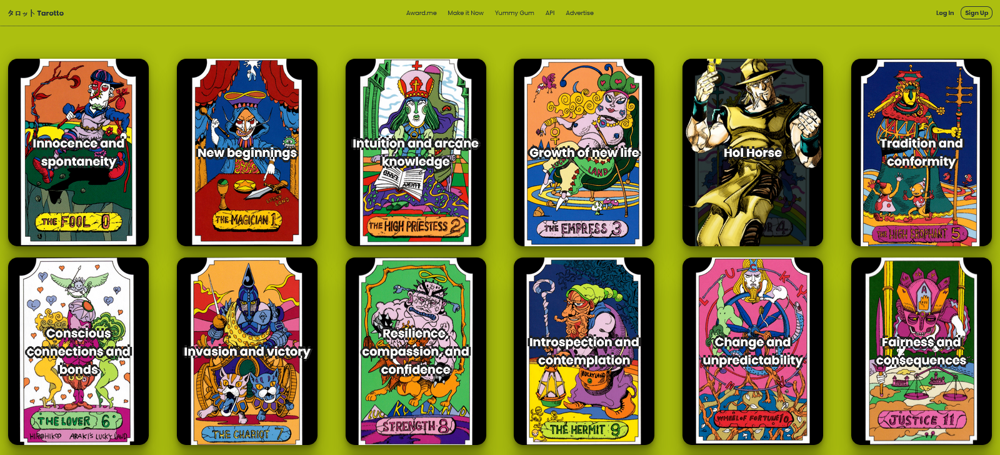

# tarot-of-marseilles-sass

> _This repo was created for learning purposes and one of the [_**#Coming Back To Programming**_](https://github.com/xvferdy/beginner-portfolio "Beginner Portfolio") activities that started on September 24 2021…_

## :round_pushpin:Table of Contents
- [About The Project](#about-the-project)
- [Technologies](#technologies)
- [Acknowledgments](#acknowledgments)

## 🌍 About the Project
Static website to show tarot card from JoJo's Bizarre Adventure. This time I learn new technologies ➤ [CSS preprocessor](https://developer.mozilla.org/en-US/docs/Glossary/CSS_preprocessor).

**Overview** 🔭

  

**Demo**
https://xvferdy.github.io/tarot-of-marseilles-sass/

## 👷‍♀️ Technologies
- Sass

## 👏 Acknowledgments
- [jojowiki.com](https://jojowiki.com/Tarot_Cards) Jojo fandom
- [Flexbox](https://flexbox.malven.co/) - Malven's Flexbox Cheatsheet
- [Grid](https://grid.malven.co/) -Malven's Grid Cheatsheet

<h3 align="right">
      <a href="#tarot-of-marseilles-sass">To Top</a>
</h3>
